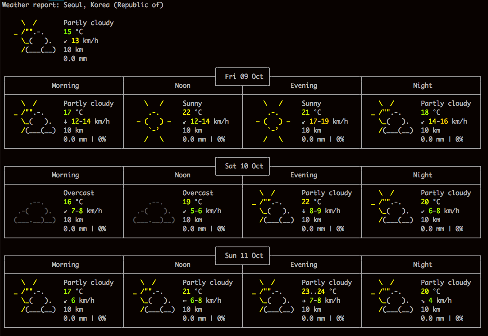
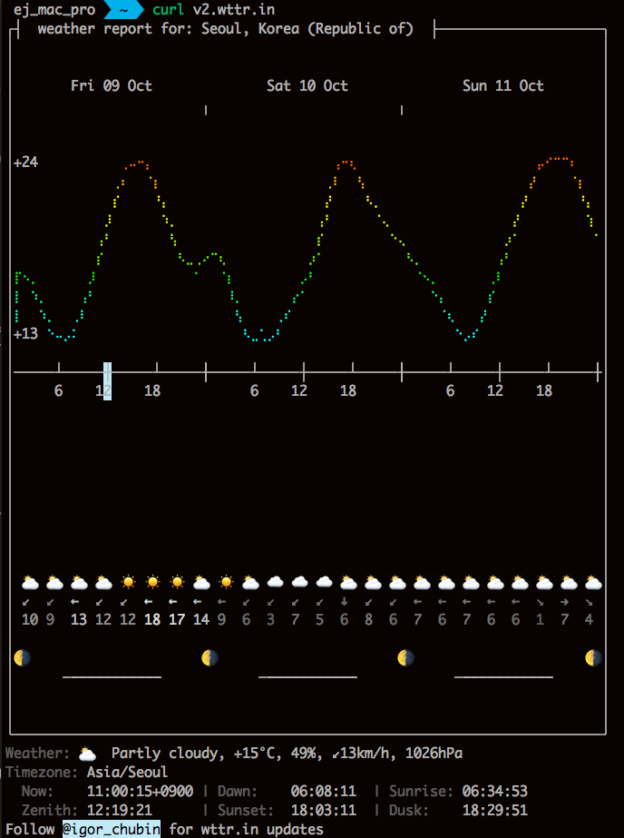

터미널을 열어서  
 
`$ curl wttr.in`

이라고 치면 오늘 날씨를 알 수 있다. 

Weather report: Seoul, Korea (Republic of)

     \  /       Partly cloudy
   _ /"".-.     15 °C
     \_(   ).   ↙ 13 km/h
     /(___(__)  10 km
                0.0 mm
                                                       ┌─────────────┐
┌──────────────────────────────┬───────────────────────┤  Fri 09 Oct ├───────────────────────┬──────────────────────────────┐
│            Morning           │             Noon      └──────┬──────┘     Evening           │             Night            │
├──────────────────────────────┼──────────────────────────────┼──────────────────────────────┼──────────────────────────────┤
│    \  /       Partly cloudy  │     \   /     Sunny          │     \   /     Sunny          │    \  /       Partly cloudy  │
│  _ /"".-.     17 °C          │      .-.      22 °C          │      .-.      21 °C          │  _ /"".-.     18 °C          │
│    \_(   ).   ↓ 12-14 km/h   │   ― (   ) ―   ↙ 12-14 km/h   │   ― (   ) ―   ↙ 17-19 km/h   │    \_(   ).   ↙ 14-16 km/h   │
│    /(___(__)  10 km          │      `-’      10 km          │      `-’      10 km          │    /(___(__)  10 km          │
│               0.0 mm | 0%    │     /   \     0.0 mm | 0%    │     /   \     0.0 mm | 0%    │               0.0 mm | 0%    │
└──────────────────────────────┴──────────────────────────────┴──────────────────────────────┴──────────────────────────────┘
                                                       ┌─────────────┐
┌──────────────────────────────┬───────────────────────┤  Sat 10 Oct ├───────────────────────┬──────────────────────────────┐
│            Morning           │             Noon      └──────┬──────┘     Evening           │             Night            │
├──────────────────────────────┼──────────────────────────────┼──────────────────────────────┼──────────────────────────────┤
│               Overcast       │               Overcast       │    \  /       Partly cloudy  │    \  /       Partly cloudy  │
│      .--.     16 °C          │      .--.     19 °C          │  _ /"".-.     22 °C          │  _ /"".-.     20 °C          │
│   .-(    ).   ↙ 7-8 km/h     │   .-(    ).   ↙ 5-6 km/h     │    \_(   ).   ↓ 8-9 km/h     │    \_(   ).   ↙ 6-8 km/h     │
│  (___.__)__)  10 km          │  (___.__)__)  10 km          │    /(___(__)  10 km          │    /(___(__)  10 km          │
│               0.0 mm | 0%    │               0.0 mm | 0%    │               0.0 mm | 0%    │               0.0 mm | 0%    │
└──────────────────────────────┴──────────────────────────────┴──────────────────────────────┴──────────────────────────────┘
                                                       ┌─────────────┐
┌──────────────────────────────┬───────────────────────┤  Sun 11 Oct ├───────────────────────┬──────────────────────────────┐
│            Morning           │             Noon      └──────┬──────┘     Evening           │             Night            │
├──────────────────────────────┼──────────────────────────────┼──────────────────────────────┼──────────────────────────────┤
│    \  /       Partly cloudy  │    \  /       Partly cloudy  │    \  /       Partly cloudy  │    \  /       Partly cloudy  │
│  _ /"".-.     17 °C          │  _ /"".-.     21 °C          │  _ /"".-.     23..24 °C      │  _ /"".-.     20 °C          │
│    \_(   ).   ↙ 6 km/h       │    \_(   ).   ← 6-8 km/h     │    \_(   ).   → 7-8 km/h     │    \_(   ).   ↘ 4 km/h       │
│    /(___(__)  10 km          │    /(___(__)  10 km          │    /(___(__)  10 km          │    /(___(__)  10 km          │
│               0.0 mm | 0%    │               0.0 mm | 0%    │               0.0 mm | 0%    │               0.0 mm | 0%    │
└──────────────────────────────┴──────────────────────────────┴──────────────────────────────┴──────────────────────────────┘

`$ curl v2.wttr.in`

라고 치면 시각적으로 더 예쁘게 나온다. 

┌┤  weather report for: Seoul, Korea (Republic of)  ├────────────────────┐
│                                                                        │
│                                                                        │
│       Fri 09 Oct              Sat 10 Oct              Sun 11 Oct       │
│                       ╷                       ╷                        │
│                                                                        │
│                                                                        │
│+24          ⢀⠤⠒⡄                      ⢠⠒⢆                      ⡤⠊⠉⠉⠆   │
│            ⢀⠆  ⠈⡆                    ⢀⠇  ⢣                    ⡜    ⠈⡆  │
│            ⡎    ⠘⡄                   ⡜    ⠣⡀                 ⡜      ⠘⡄ │
│           ⡸      ⠱⡀                 ⢠⠃     ⠈⢄               ⡜        ⢱ │
│          ⢠⠃       ⢣                 ⡎        ⠑⢄            ⡰⠁         ⠁│
│          ⡎         ⠣⣀⢀⠔⠉⢆          ⡰⠁          ⠣⡀         ⢠⠃           │
│⡏⠢⡀      ⡸            ⠁  ⠈⡆        ⡠⠃            ⠈⠢⡀      ⢀⠇            │
│⡇ ⠱⡀    ⢠⠃                ⠸⡀      ⡔⠁               ⠑⡄     ⡎             │
│⡇  ⠱⡀  ⢀⠇                  ⢣    ⢀⠎                  ⠈⢆   ⡜              │
│+13 ⠑⠤⡠⠅                    ⠣⣀⢁⡠⠃                     ⠑⡠⠎               │
│                                                                        │
│─────┴─────┼─────┴─────╂─────┴─────┼─────┴─────╂─────┴─────┼─────┴─────╂│
│     6    12    18           6    12    18           6    12    18      │
│                                                                        │
│                                                                        │
│                                                                        │
│                                                                        │
│                                                                        │
│                                                                        │
│                                                                        │
│                                                                        │
│                                                                        │
│ ⛅️ ⛅️ ⛅️ ⛅️ ☀️  ☀️  ☀️  ⛅️ ☀️  ⛅️ ☁️  ☁️  ☁️  ⛅️ ⛅️ ⛅️ ⛅️ ⛅️ ⛅️ ⛅️ ⛅️ ⛅️ ⛅️ ⛅️│
│ ↙  ↙  ←  ↙  ↙  ←  ←  ←  ←  ↙  ↙  ↙  ↙  ↓  ↙  ↙  ←  ←  ←  ←  ←  ↘  →  ↘ │
│ 10 9  13 12 12 18 17 14 9  6  3  7  5  6  8  6  7  6  7  6  6  1  7  4 │
│                                                                        │
│🌗                     🌗                      🌗                     🌗│
│      ─━━━━━━━━━━━            ─━━━━━━━━━━━            ─━━━━━━━━━━━      │
│                                                                        │
│                                                                        │
└────────────────────────────────────────────────────────────────────────┘

Weather: ⛅️  Partly cloudy, +15°C, 49%, ↙13km/h, 1026hPa

Timezone: Asia/Seoul
  Now:    11:00:15+0900 | Dawn:    06:08:11  | Sunrise: 06:34:53
  Zenith: 12:19:21      | Sunset:  18:03:11  | Dusk:    18:29:51
  
  
Follow @igor_chubin for wttr.in updates

